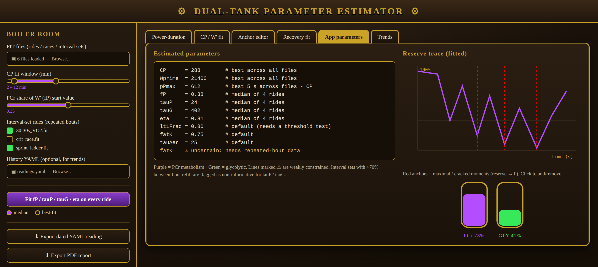
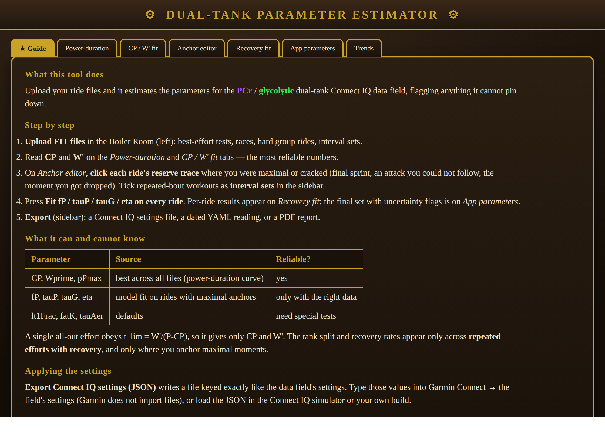
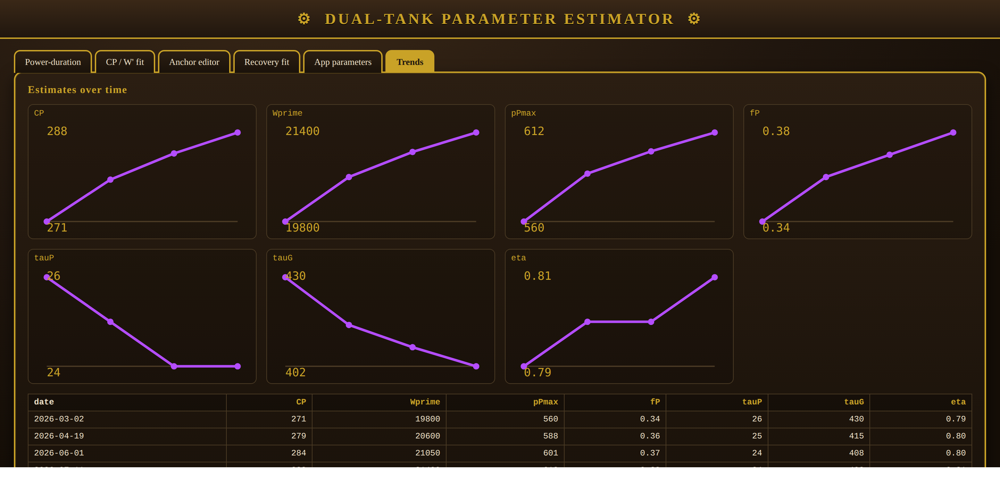
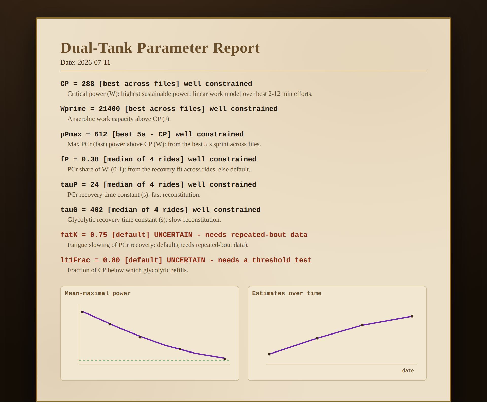

# Dual-Tank Parameter Estimator

A small **R Shiny** app that turns your ride files into the settings for the AnaerobicFuelTanks
Connect IQ data field. Upload some `.FIT` files, and it figures out your **CP**, **W′**, and — where
your data allows — the PCr/glycolytic split and recovery rates, flagging anything it can't pin down.

Styled in a steampunk look: **purple = PCr**, **green = glycolytic**, brass on walnut.



The app opens on a built-in **★ Guide** tab with these instructions, so you don't need this page while using it:



---

## TL;DR — how to use it

```r
install.packages(c("shiny", "bslib", "ggplot2", "DT", "yaml"))
remotes::install_github("grimbough/FITfileR")
shiny::runApp("tools/calibrate")            # from the repo root
```

1. **Upload FIT files** (best-effort tests, races, hard group rides, interval sets).
2. Read **CP / W′** off the *Power-duration* and *CP / W′ fit* tabs — these come from the best
   efforts across all your files and are the most reliable numbers.
3. On the *Anchor editor* tab, **click each ride's reserve trace** where you were maximal /
   cracked (final sprint, the attack you couldn't follow, the moment you got dropped). Mark
   repeated-bout workouts as **interval sets** in the sidebar.
4. Hit **Fit fP / tauP / tauG / eta on every ride** → the *Recovery fit* tab shows a per-ride
   table; the *App parameters* tab shows the final set with **uncertainty flags**.
5. **Export**: a **Connect IQ settings JSON** (keyed exactly like the field's settings), a dated YAML reading, and/or a PDF report. Re-upload the YAML later to see **trends**.

---

## What it can and can't know (the important bit)

A single all-out effort obeys `t_lim = W′/(P − CP)` — it depends only on your total anaerobic
capacity and CP. So:

| Parameter | Where it comes from | Reliable? |
|---|---|---|
| `CP`, `Wprime`, `pPmax` | best across all files (combined power-duration curve) | ✅ yes |
| `fP`, `tauP`, `tauG`, `eta` | model fit on rides with maximal **anchors** | ⚠ only with the right data |
| `lt1Frac`, `fatK`, `tauAer` | defaults | ❌ need special tests |

The split and recovery rates only show up across **repeated efforts with recovery**, and only when
you tell the app where you were at your limit. Everything weakly-constrained is flagged, never
silently guessed.

---

## The tabs

- **Power-duration / CP / W′ fit** — the mean-maximal power curve across your files and the
  `W = CP·t + W′` fit (with R² and duration range).
- **Anchor editor** — click a ride's reserve trace to add/remove "reserve = 0" anchors; per-ride
  diagnostics show bouts above CP, mean recovery, and **between-bout refill %**.
- **Recovery fit** — per-ride fitted `fP/tauP/tauG/eta` with flags (`few-bouts`, `rest-too-long`,
  `no-converge`, `poor-fit`); combined by median or best-fit.
- **App parameters** — the final block to paste into the field settings, each line flagged if
  uncertain.
- **Trends** — each value over time when you supply a history YAML.

### Interval sets & repeated bouts

Mark repeated-bout workouts as interval sets. There are two kinds:

- **To failure** — the last bout drove you to (or near) empty. Gets a `reserve = 0` anchor and
  constrains recovery well, **if the rest is short enough** that the tanks don't refill between bouts
  (the app measures between-bout refill and **flags sets with >70% refill** as uninformative for
  `tauP`/`tauG`).
- **Submaximal** — repeated bouts you completed **with margin** (you could have done more). Tick these
  in the separate "submaximal" list. The fit then uses **only feasibility + the recovery between
  bouts** — no `reserve = 0` anchor is forced, since you never emptied the tank. The recovery table
  reports the **reserve margin** you kept and flags the result `submax-weak` (low-confidence, and
  excluded from the combined estimate unless nothing better is available). Submaximal repeated bouts
  genuinely carry little information about recovery kinetics — this keeps the app honest rather than
  inventing precise `tauP`/`tauG` from data that can't support them.

### Races and hard group rides

They work well — lots of repeated near-maximal surges. Just anchor where you were at the limit;
**getting dropped** is a perfect natural "reserve = 0" anchor.

---

## Trends over time

Supply a previously-exported history YAML and the **Trends** tab plots each tracked value over time:



---

## PDF report

**Export PDF report** produces an aged-parchment sheet explaining where each parameter stands —
value, source, and whether it's well-constrained or uncertain (and why) — with the key plots:



---

## Connect IQ settings export

**Export Connect IQ settings (JSON)** writes the estimated values keyed exactly like the data
field's `properties.xml` (`CP`, `Wprime`, `fP`, `pPmax`, `tauP`, `tauG`, `lt1Frac`, `eta`, `fatK`,
`tauAer`). Garmin Connect doesn't import files, so type them into the field's settings — or load the
JSON in the Connect IQ simulator / your own build.

```json
{
  "CP": 288,
  "Wprime": 21400,
  "fP": 0.38,
  "pPmax": 612,
  "tauP": 24,
  "tauG": 402,
  "lt1Frac": 0.8,
  "eta": 0.81,
  "fatK": 0.75,
  "tauAer": 25
}
```

## YAML format

The dated export appends to any supplied history, giving a multi-reading file:

```yaml
readings:
  - date: 2026-07-11
    CP: 288
    Wprime: 21400
    pPmax: 612
    fP: 0.38
    tauP: 24
    tauG: 402
    eta: 0.81
    flags: [fatK, lt1Frac, tauAer]   # params that were uncertain
```

---

## Notes

- FIT files must contain a `power` record field. Files are rebuilt onto a true 1 Hz timeline by
  timestamp — autopause gaps become 0 W, and power meters that add/drop optional fields mid-ride
  (pedal smoothness, torque effectiveness, respiration, HRV) are merged in time order rather than
  concatenated by field-signature. Without this, paused/interval files (e.g. VO2max hill reps) yield
  wildly inflated long-duration power and an impossible CP.
- If `FITfileR` can't read a file — most often because it carries **developer data fields** (HRV apps
  writing `Alpha1`/`RespirationRate`, W′bal fields, radar, carbs/fat) — the app falls back to a small
  built-in base-R FIT decoder that pulls power + timestamp straight from the record messages. The
  sidebar's per-file load report shows which reader succeeded (or why a file failed).
- Fonts (`Cinzel`, `EB Garamond`) load from Google at startup — needs a network connection the first
  time; swap `font_google(...)` for local fonts to run fully offline.
- The recovery fit uses `optim` (L-BFGS-B); the feasibility/anchor weighting is a tunable constant —
  inspect per-ride objectives and reserve traces before trusting values.
- This is a **sketch**: it runs, but validate the fits on your own data before racing on the numbers.
- The `mockup-*.html`/`ui-mockup.html` files are static previews only; the live app is `app.R`.

## Deploy

`manifest.json` (Posit Connect / rsconnect descriptor) is included so the app can be deployed —
e.g. to **shinyapps.io** or a **git-backed Posit Connect** content item.

The committed `manifest.json` lists the **direct** dependencies as a starting point. For a
reproducible deploy, regenerate it against your own R library (it then pins exact versions and the
full dependency closure) and deploy — see `deploy.R`:

```r
install.packages("rsconnect")
setwd("tools/calibrate")
rsconnect::writeManifest(appDir = ".")                 # refresh manifest.json exactly
rsconnect::deployApp(appDir = ".", appName = "dual-tank-calibrate")  # or push to git-backed Connect
```

Update `platform` in `manifest.json` to your R version. `FITfileR` is a GitHub package
(`grimbough/FITfileR`); `writeManifest()` records it automatically once installed from GitHub.
